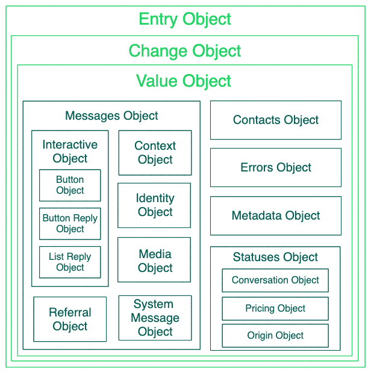
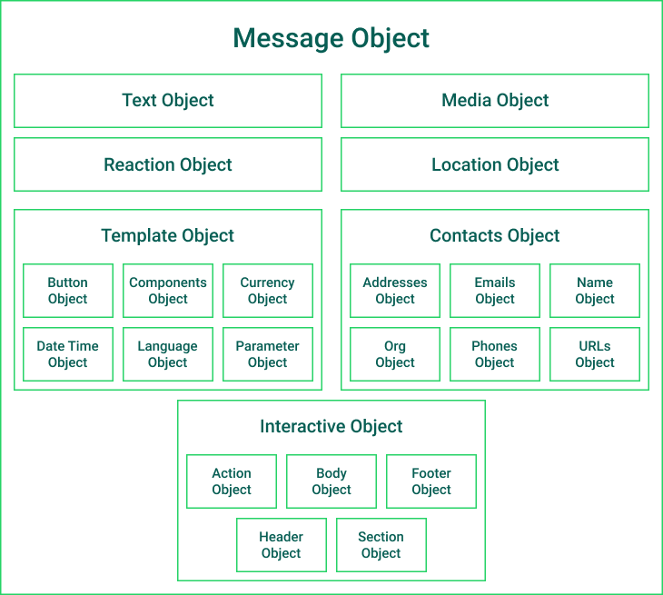

# Overview

The WhatsApp Business API to communicate with our customers at scale. Using the API, businesses can build systems that connect thousands of customers with agents or bots, enabling both programmatic and manual communication. Additionally, we can integrate the API with numerous backend systems, such as CRM and marketing platforms.

## Webhooks

Our webhook servers should be able to withstand 3x the capacity of outgoing message traffic and 1x the capacity of expected incoming message traffic. For example, if sending 1,000 mps with a 30% expected response rate, your servers should be able to process up to 3000 message status webhooks plus an additional 300 incoming message webhooks.

## Rate Limits

Each API call made by our app to any of a WABA'S business phone numbers (i.e. the WhatsApp Business Account Phone Number node or any of its edges, such as the Messages endpoint) counts against its limit.

The current limit is 11,880,000 API calls per rolling-hour for a given WABA.

## Encryption

With the Cloud API, every WhatsApp message continues to be protected by Signal protocol encryption that secures messages before they leave the device. This means messages with a WhatsApp business account are securely delivered to the destination chosen by each business.

